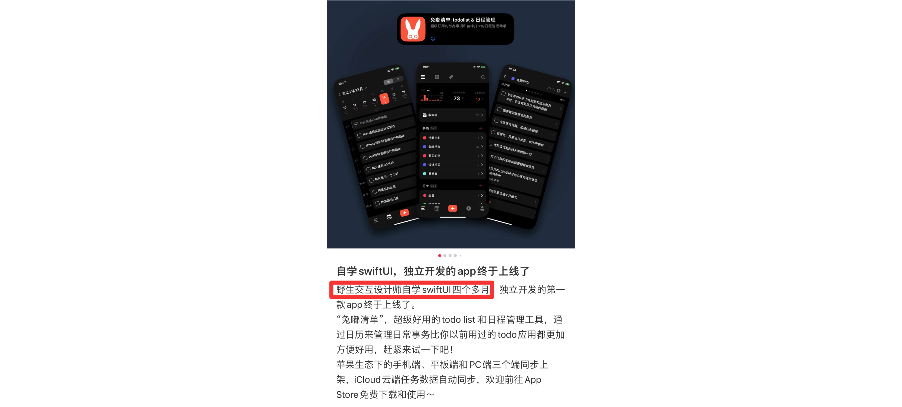
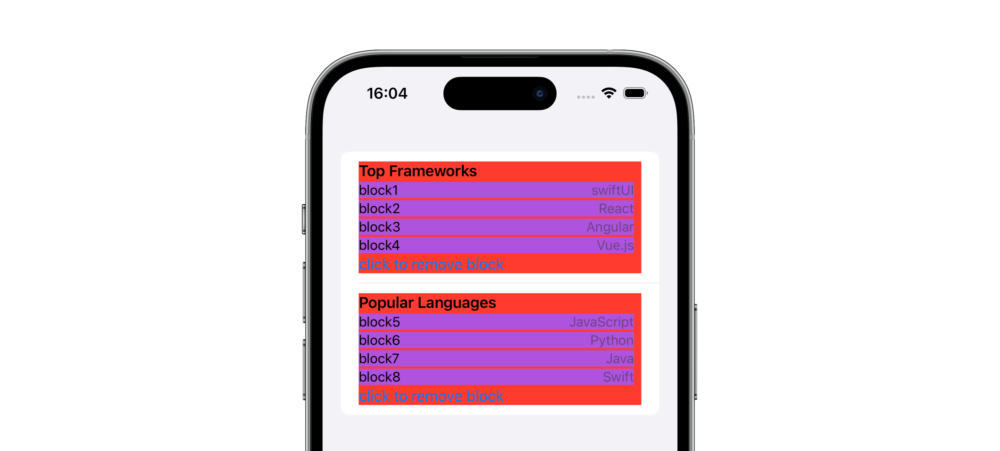

Language：English｜<a href="./README_cn.md">中文</a>｜

<div align="center">
  
	  <p>This is an article about how to use SwiftUI to build the architecture of a large-scale app.</p>
</div>

# SwiftUI Best Practice

Author：bbc6bae9


## 1、Why SwiftUI？

(1) **Simplicity**: SwiftUI is so simple that even independent developers with a design background can master it. For mature developers experienced in both OC and Swift, it takes only about a week to develop a complete prototype product after mastering SwiftUI. The development efficiency is astonishing.



（2）**Cross-platform**: On GitHub, you can see more and more open-source client projects migrating to SwiftUI. This is because maintaining apps on multiple platforms is a very costly endeavor.

（3）**Official support**: As economic interests are closely related, I once read a sentence in a technical blog that said, "Only Apple itself will truly consider the developers in its own ecosystem because of its practical economic interests." This is also the root cause of the inadequacy of third-party frameworks.

> Apple's philosophy is: "Leave the technology to me, you go innovate, and let's make money together."
>
> Third-party: No money, no reputation, no benefits. Sorry, we can no longer maintain it and have handed it over to the community.

（4）**Clean and elegant code**: The relatively fixed development routines greatly reduce the development difficulty and maintainability. Over the years, my work experience has shown that engineers are a very creative group, creating architecture patterns such as `MVC`, `MVCS`,  `MVVM`, ` MVP`, and  `VIPER` , in addition to the design patterns written in textbooks. In each team, there are also more complex code designs and practices (which are indeed very clever, but difficult to understand!). Like UIKit, SwiftUI is a blank canvas, allowing you to develop using any architecture and code design. However, overall, SwiftUI is a reactive UI framework, and from official demos and community best practices, it is generally more suitable for MVVM. For specific best practices, please refer to the section below the article.

（5）**Good compatibility**: Swift seamlessly supports Objective-C, and SwiftUI seamlessly supports UIKit, so previous code can still be used.

（6）**Reactive**: It is reactive and naturally size-adaptive, with different expressions for the iPad in portrait and landscape modes, and comes with the system's smooth animations. Compared to code that hardcodes frames and repeatedly checks for portrait or landscape orientation (although autolayout can also solve this with slightly more code), it is definitely more efficient.

（7）**Previewable**: The biggest benefit of previewing for me is that if I take over the development of a certain view, I don't need to laboriously construct data and constantly look at the context of the code to analyze it. What you see is what you get, and you can complete development and iteration in the current view.

## 2、Simple UI

Regarding the development of simple UIs, it's unlikely that there are better tutorials available than the official SwiftUI tutorials. 

1. [Creating and combining views](https://developer.apple.com/tutorials/swiftui/creating-and-combining-views)
2. [Building list and navigation](https://developer.apple.com/tutorials/swiftui/building-lists-and-navigation)
3. [Handling user input](https://developer.apple.com/tutorials/swiftui/handling-user-input)
4. [Drawing paths and shapes](https://developer.apple.com/tutorials/swiftui/drawing-paths-and-shapes)
5. [Animating views and transiations](https://developer.apple.com/tutorials/swiftui/animating-views-and-transitions)
6. [Composing complex interfaces](https://developer.apple.com/tutorials/swiftui/composing-complex-interfaces)
7. [Working with UI sontrols](https://developer.apple.com/tutorials/swiftui/working-with-ui-controls)
8. [Interfacing with UIKit](https://developer.apple.com/tutorials/swiftui/interfacing-with-uikit)
9. [Creating watchOS app](https://developer.apple.com/tutorials/swiftui/creating-a-watchos-app)
10.  [Creating macOS app](https://developer.apple.com/tutorials/swiftui/creating-a-macos-app)

## 3、MVVM

The MVVM design pattern and reactive frameworks are a match made in heaven.

`Model`: Data requested from local or remote sources

`ViewModel`: Interacts directly with the page, details View's user operations

`View`: SwiftUI.View, responds to data changes in the viewModel


## 4、Page with network response

We can define a enum called DataFetchPhase to store the state of the network

```swift
enum DataFetchPhase<T> {
    case empty
    case success(T)
    case failure(Error)
    
    var value: T? {
        if case.success(let t) = self {
            return t
        }
        return nil
    }
}
```

`empty`：loading state

`success(T)`：success state. and the network response is T

`failure(Error)`：failure state

View

```swift
import SwiftUI

public struct DemoPage: View {
    // MARK: Lifecycle
    public init() {
        self.getPage()
    }

    // MARK: Public

    public var body: some View {
        switch self.pageVM.phase {
        case .empty:
            ProgressView()
        case .success(let netResponse):
            ScrollView {
                ListView(response: netResponse)
                Color.clear.task {
                    self.loadMore()
                }
            }
        case .failure(_):
            ErrorPage(action: {
                self.getPage()
            }, title: "加载失败", buttonTitle: "立即重试")
        }
    }

    // MARK: Internal

    /// 数据请求的vm
    @ObservedObject var pageVM: UNPageViewModel

    // MARK: Private

    /// 获取页面数据
    private func getPage() {
        Task {
            await pageVM.refreshPage()
        }
    }
    
    /// 获取更多数据
    private func loadMore() {
        Task {
            await pageVM.loadMore()
        }
    }
}
```

ViewModel

```
@MainActor
class DemoPageViewModel: ObservableObject {
		/// 网络请求状态
    @Published var phase = UNDataFetchPhase<NetResponse>.empty
    
    func refreshPage(){
		   // ...
		   // 网络请求结束后给phase赋值
		   phase = ...
    }
    
    func loadMore(){
       // ...
    }
}
```

Model

```swift
struct NetResponse {
	// ...
}
```


## 5、Complex Card Page



Assign a ViewModel to each page and card for complex pages with multiple layers.

Server provide nested data like following format.

```json
[{
    "title": "Top Frameworks",
    "blocks": [{
        "title": "block1",
        "subTitle": "swiftUI"
    }, {
        "title": "block2",
        "subTitle": "React"
    }, {
        "title": "block3",
        "subTitle": "Angular"
    }, {
        "title": "block4",
        "subTitle": "Vue.js"
    }]
}, {
    "title": "Popular Languages",
    "blocks": [{
        "title": "block5",
        "subTitle": "JavaScript"
    }, {
        "title": "block6",
        "subTitle": "Python"
    }, {
        "title": "block7",
        "subTitle": "Java"
    }, {
        "title": "block8",
        "subTitle": "Swift"
    }]
}]
```

The red one is the `Father Card`，the purple one is `Child Card`

> Page and every card has it's own Model、View和ViewModel
>

talk is cheap: [complex_card_in_swiftui](./complex_card_in_swiftui)

## 6、App Design

Due to the lack of best practices guidance for SwiftUI, many issues have been discovered during actual development, such as repeated initialization of pages on the navigation stack and the problem of loading all tab pages at once. After carefully analyzing the architectural requirements, the architectural design requirements for both SwiftUI and UIKit apps are consistent:

`Page organization`: Each tab can lazily load its own module, and each tab has a root page with its own independent navigation that can be pushed down indefinitely.

`Routing`: This involves the issue of in-site and out-of-site routing, with the aim of decoupling pages from each other.

### 6.1 Page organization

(1) lazyload for tab's root view

```swift
struct LazyView<Content: View>: View {
    private let build: () -> Content
    public init(_ build: @autoclosure @escaping () -> Content) {
        self.build = build
    }
    public var body: Content {
        build()
    }
}

struct VBTabView: View {
    @Environment(Router.self) private var router
    
    /// 推荐
    var feedPage: some View = LazyView(HomePage())
    
    /// 我的
    var profilePage: some View = LazyView(ProfilePage())
    
    var body: some View {
        TabView(selection: self.router.tabBinding) {        
            TabPage(tab: .home) {
                feedPage
            }
            TabPage(tab: .profile) {
                profilePage
            }
        }
    }
}
```

(2) Navigation

```swift
import SwiftUI

struct TabPage<Content: View>: View {
    let tab: Tab
    let content: () -> Content

    var body: some View {
        NavStack(tab: self.tab) {
            self.content()
                .navigationDestination(for: Route.self, destination: { route in
                    switch route {
                    case .detail(let cid):
                        VideoDetailPage(cid: cid)
                    case .userSpacePage(let mid):
                        UpSpacePage(mid: mid)
                    case .userInfo:
                        UserInfoPage()
                    }
                })
        }
        .tabItem {
            tab.label()
        }
        .tag(self.tab)
    }
}
```

### 6.2 Routing

In App Router

```swift
// 站内路由
enum Route: Hashable {
    // 视频详情页
    case detail(cid: Int)

    // 个人空间
    case userSpacePage(mid: Int)
}
```

Router for deeplink

```swift
import SwiftUI

@main
struct ScaffoldApp: App {
    @State var router: Router = .init()
    private static let scheme = "txvideo"
    private static let host = "v.qq.com"
    var body: some Scene {
        WindowGroup {
            ContentView()
                .environment(self.router)
                .onOpenURL(perform: { url in
                    guard url.scheme == ScaffoldApp.scheme,
                          url.host() == ScaffoldApp.host else {
                        return
                    }
                    let path = url.path()
                    // 详情页面的路由处理
                    if path == "detail" {
                        if let params = url.params(),
                           let cid = params["cid"],
                            let cidInt = Int(cid)
                        {
                            router.pushToActiveTab(route: .detail(cid: cidInt))
                        }
                    }
                })
        }
    }
}
```

finally，talk is cheap: [scaffold_swiftui](./scaffold_swiftui)
